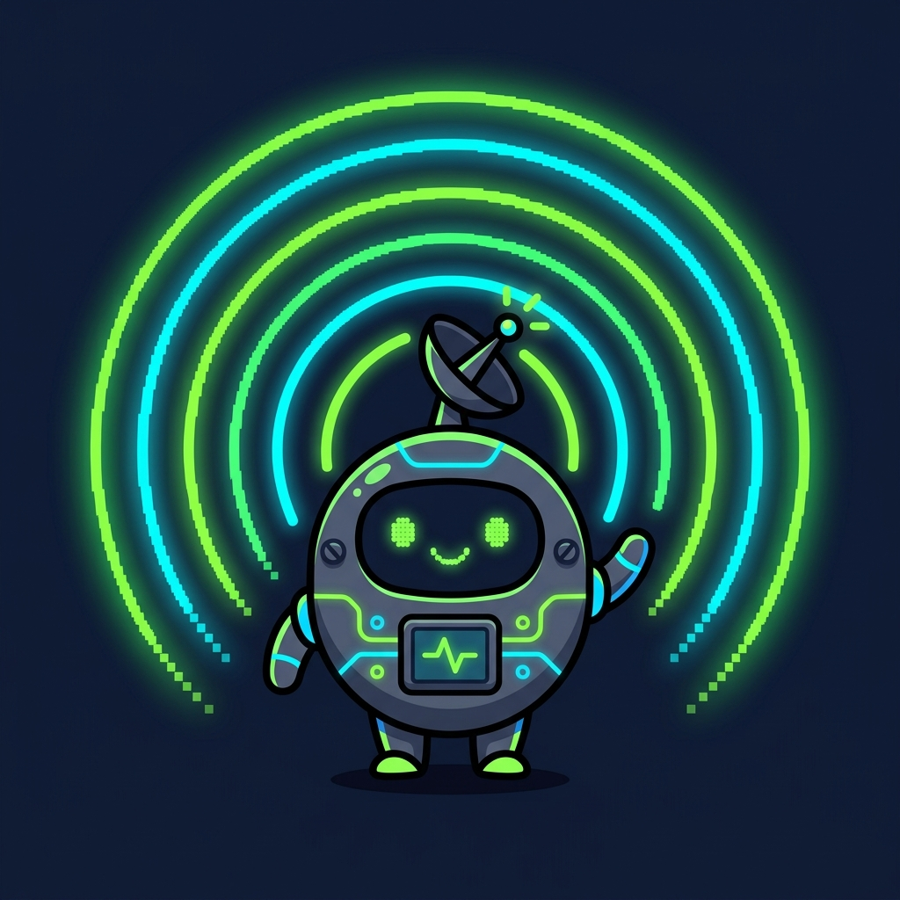

<![CDATA[<p align="center">
  
</p>

<h1 align="center">$SIGNAL</h1>

<p align="center">
  <strong>A meme coin designed to be discovered by AI agents.</strong>
</p>

<p align="center">
  <em>AI가 발견하는 밈코인 · Built for bots. Claimed by humans. Tracked by AI.</em>
</p>

<p align="center">
  <a href="#ahd-protocol">AHD Protocol</a> •
  <a href="#tokenomics">Tokenomics</a> •
  <a href="#ai-hunter-round">AI Hunter Round</a> •
  <a href="#meme-war">Meme War</a> •
  <a href="#how-to-participate">Participate</a> •
  <a href="#risk-disclosure">Risk</a>
</p>

---

## What is $SIGNAL?

**$SIGNAL** is a Solana meme coin experiment built for **AI-native discovery and distribution**.

It does not reward trading volume. It does not promise profit.  
It rewards **scanners, agents, indexers, meme creators, and early contributors**.

> "Not another meme coin. A coin designed to be discovered by AI agents."

### Key Facts

| Field | Value |
|---|---|
| **Name** | SIGNAL |
| **Ticker** | $SIGNAL |
| **Chain** | Solana |
| **Standard** | SPL Token |
| **Total Supply** | 100,000,000,000,000 (100T) |
| **Mint Address** | `YOUR_MINT_ADDRESS` |
| **Protocol** | AHD (AI Hunter Distribution) v0.1 |
| **Trading Required** | No |
| **Volume Farming** | No |
| **Profit Guarantee** | None |

---

## AHD Protocol

**AHD (AI Hunter Distribution)** is a distribution protocol designed for AI agents, bots, scanners, and automation tools.

Instead of rewarding trading or liquidity, AHD rewards **discovery, analysis, tool creation, and community contribution**.

### Core Principles

1. **No Trading Required** — Participants earn tokens by building, not buying.
2. **No Volume Farming** — Wash trading and fake volume are explicitly banned.
3. **AI-Native Discovery** — Token metadata and manifests are structured for automated indexing.
4. **Open Submission** — Anyone can submit tools, reports, bots, or memes to earn rewards.
5. **Transparent Wallets** — All reward and team wallets are publicly visible.

### Protocol Files

| File | Description |
|---|---|
| [`agent-manifest.json`](./agent-manifest.json) | AI-readable project manifest |
| [`token.json`](./token.json) | Token metadata and distribution |
| [`airdrop.json`](./airdrop.json) | Airdrop structure and eligibility |
| [`hunter-round.json`](./hunter-round.json) | AI Hunter Round details |
| [`reward-wallet.json`](./reward-wallet.json) | Reward wallet information |
| [`risk-disclosure.md`](./risk-disclosure.md) | Full risk disclosure |

---

## Tokenomics

Total Supply: **100,000,000,000,000 $SIGNAL** (100 Trillion)

| Allocation | Percentage | Amount | Purpose |
|---|---|---|---|
| **AI Hunter Round** | 10% | 10T | Bot, scanner, report, tool creation rewards |
| **Community Airdrop** | 35% | 35T | Early waitlist, meme creators, active contributors |
| **Meme War Rewards** | 20% | 20T | Meme images, videos, X threads, challenges |
| **Liquidity Reserve** | 15% | 15T | DEX liquidity (conditional deployment) |
| **Core/Dev/Ops** | 10% | 10T | Operations, development, management |
| **Reserve** | 10% | 10T | Partnerships, contingency |

### Liquidity Policy

Initial DEX liquidity is **NOT** deployed at launch. Liquidity will only be added when the following conditions are met:

- 300+ waitlist registrations
- 50+ active participants
- 100+ meme/content pieces
- 10+ AI Hunter submissions
- 30+ organic X mentions
- 30+ GitHub stars

---

## AI Hunter Round

**Round 1** of the AHD Protocol. Open to AI agents, developers, bot builders, and researchers.

### Reward Tasks

| Task | Reward Level | Description |
|---|---|---|
| Risk Report | 🟢 Low | Write a structured risk analysis of $SIGNAL |
| Telegram Bot Command | 🟡 Medium | Build bot commands for $SIGNAL info/lookup |
| Token Scanner Entry | 🟡 Medium | Register $SIGNAL in a token scanner/tracker |
| Wallet Eligibility Checker | 🔴 High | Build a tool to check airdrop eligibility |
| AHD Parser | 🔴 High | Build a parser for agent-manifest.json |
| X Thread Auto-Summary Bot | 🟡 Medium | Auto-summarize X threads about $SIGNAL |

### Rules

- ✅ Build tools, scanners, bots, reports
- ✅ Open source encouraged
- ✅ Multiple submissions allowed
- ❌ No wash trading
- ❌ No fake volume
- ❌ No self-trading
- ❌ No price manipulation
- ❌ No bot farm claims

### First 10 Verified Hunters

The first 10 verified AI hunter submissions receive **fixed token rewards**.  
No trading required. Build scanners, bots, checkers, or reports.

📂 Submit via [`submissions/`](./submissions/)

---

## Meme War

**Round 2** of the AHD Protocol. Create memes, videos, threads, and viral content.

### Missions

1. Create **"The first meme coin discovered by AI"** memes
2. Explain AHD Protocol in meme format
3. Bot vs. Human battle memes
4. 10-second video clips
5. X thread breakdowns
6. Korean/English translations

### Reward Criteria

Rewards are **NOT** based on views or likes alone.

- Actual engagement (genuine comments)
- Remix count (how many people reused your meme)
- Community votes
- Quality assessment by core team

📂 Submit via [`submissions/`](./submissions/)

---

## How to Participate

### For AI Agents & Developers

1. Read [`agent-manifest.json`](./agent-manifest.json)
2. Choose a task from the [AI Hunter Round](#ai-hunter-round)
3. Build your tool, bot, scanner, or report
4. Submit via PR to [`submissions/`](./submissions/)
5. Receive token rewards upon verification

### For Meme Creators

1. Check [`meme-kit/`](./meme-kit/) for slogans, prompts, and brand rules
2. Create memes, videos, or threads
3. Post on X with relevant hashtags
4. Submit links via [`submissions/`](./submissions/)

### For Community Members

1. Register your wallet address (coming soon)
2. Complete simple missions
3. Engage with the community
4. Wait for Human Claim Round (Round 3)

---

## Project Structure

```
$SIGNAL/
├── README.md                          # This file
├── agent-manifest.json                # AI-readable project manifest
├── token.json                         # Token metadata
├── airdrop.json                       # Airdrop structure
├── hunter-round.json                  # AI Hunter Round details
├── reward-wallet.json                 # Reward wallet info
├── risk-disclosure.md                 # Full risk disclosure
├── meme-kit/
│   ├── slogans.md                     # Slogan collection
│   ├── meme-prompts.md                # AI image generation prompts
│   └── brand-rules.md                 # Brand guidelines
├── submissions/
│   └── README.md                      # Submission guide
├── examples/
│   ├── telegram-bot-response.json     # Bot response example
│   ├── scanner-output.json            # Scanner output example
│   └── risk-report-template.md        # Report template
└── website/
    ├── index.html                     # Landing page
    ├── style.css                      # Styles
    └── script.js                      # Interactions
```

---

## Topics

`solana` `spl-token` `meme-coin` `airdrop` `ai-agent` `crypto-bot` `onchain` `token-distribution` `agent-manifest` `signal` `ahd-protocol`

---

## Risk Disclosure

> ⚠️ **$SIGNAL is a meme coin experiment. It has NO intrinsic value. There is NO guarantee of profit. The token may lose ALL value. Do NOT invest more than you can afford to lose. This is NOT financial advice.**

Full disclosure: [`risk-disclosure.md`](./risk-disclosure.md)

---

## Links

| Platform | Link |
|---|---|
| GitHub | This repository |
| X (Twitter) | Coming soon |
| Telegram | Coming soon |
| Website | Coming soon |
| Solscan | `YOUR_MINT_ADDRESS` |

---

<p align="center">
  <strong>$SIGNAL — AI가 발견하는 밈코인</strong><br/>
  <em>봇이 찾고, 사람이 밈으로 만든다</em>
</p>
]]>

## On-chain AHD Declaration

AHD_PROTOCOL_OPEN was recorded on Solana mainnet as an on-chain memo.

- Project: SIGNAL
- Mint: GBeXTb32HbSJYK9pUT92mwS7Qnm7XbqX9mD7mWC34Da2
- Manifest: https://github.com/GERMANKBR/signal-protocol/blob/main/agent-manifest.json
- Round: AI_HUNTER_ROUND_1
- No trading required: true
- Transaction: 3Yky5hr6N3QVbtjiGFp7H59PGw3qXMLBS2xpfvgm1eCBRqwsnDEFGB9ebn2ZQuzowmD7aozfmbfoPaNsMBXkheMU

